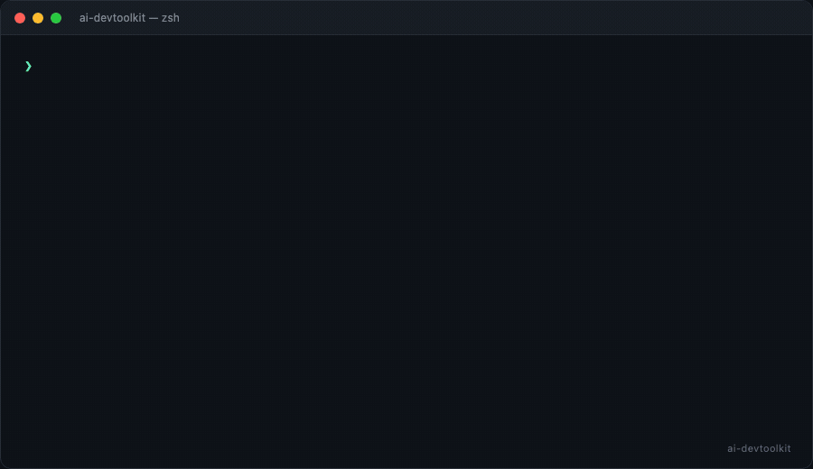

# 🚀 devtoolkit

**简体中文 | [English](README.en.md)**

> 将任意网页或 PDF 文档，1 秒转化为 AI Agent（Cursor / Codex / Claude）的专属技能包！

[](https://opensource.org/licenses/MIT)
[](https://www.typescriptlang.org/)
[](https://nodejs.org/)
[](https://github.com/xkun1/ai-devtoolkit/actions)

---

## ✨ 它能做什么？

你有一堆 API 文档、SDK 指南、技术规范——每次让 AI 写代码都要手动粘贴。
**devtoolkit** 自动把这些文档提炼成 AI Agent 能直接加载的技能包：

| 输入 | → | 输出 |
|------|:---:|------|
| 📄 网页 URL | → | 🤖 Codex `.agents/skills/<name>/SKILL.md` |
| 📕 PDF 文档 | → | 🎯 Cursor `.cursor/rules/<name>.mdc` |
| ⚡️ Swagger / OpenAPI 规范 | → | 🛠️ 结构化 API 技能手册（节省 80%~90% Token，[Benchmark](docs/benchmark.md)） |
| 📝 Markdown | → | 🧠 Claude `CLAUDE.md` + `.claude/rules/`（超长时） |
| 📚 多文档合并 | → | 🧩 分块提炼后的融合技能包 |
| 📂 批量目录处理 | → | 🤖 每个文件独立技能包（或 `--merge` 合并） |
| 🔌 MCP Server | → | 🤖 AI Agent 原生工具调用 |

## 🎬 快速开始



```bash
# 零安装直接用
npx ai-devtoolkit https://docs.example.com/api --type codex

# 从本地 PDF 生成 Cursor 规则
npx ai-devtoolkit ./sdk-guide.pdf --type cursor

# 从 Markdown 生成 Claude 项目记忆
npx ai-devtoolkit ./CONTRIBUTING.md --type claude

# 多文档合并为一个技能包
npx ai-devtoolkit ./api.md ./sdk.md ./errors.md --type codex

# 自定义技能名
npx ai-devtoolkit ./api.md --name my-api-spec

# stdout 模式：直接管道给其他工具
npx ai-devtoolkit ./api.md --stdout >> ./SKILL.md

# 无参数 → 交互式向导
npx ai-devtoolkit
```

### 🔄 跨 Agent 规则互转与同步（Cursor / Codex / Claude）

在任意项目中一键将 Cursor 规则、Codex 技能包、Claude 记忆相互转换，或直接全项目同步：

```bash
# 1. 单文件互转：把 Cursor 规则转为 Codex Skill
devtoolkit --convert .cursor/rules/api.mdc --type codex

# 2. 把 Claude 记忆转为 Cursor 规则
devtoolkit --convert CLAUDE.md --type cursor

# 3. 项目一键全量同步（自动检测项目已有规则，同步分发至其他 Agent）
devtoolkit --sync

# 4. 仅预览同步计划（不写入文件）
devtoolkit --sync --dry-run
```

### 🔍 代码搜索模式（不用打开 IDEA 了！）

在任意项目中初始化一次索引，之后直接用自然语言搜索代码，精准定位到文件和行号：

```bash
# 1. 初始化扫描当前项目（构建索引）
devtoolkit --scan-code

# 2. 直接搜索（自动加载已有索引）
devtoolkit --search "用户登录验证逻辑"

# 3. 扫描 + 搜索一条龙
devtoolkit --scan-code --search "分页查询实现"

# 4. 进入交互式搜索 REPL（连续搜索）
devtoolkit --scan-code
# > 🔍 > 用户认证流程
# > 🔍 > 分页组件
# > 🔍 > :q 退出

# 5. 不使用 LLM 解释，仅显示匹配代码
devtoolkit --search "OrderService" --no-explain

# 6. 搜索指定项目目录
devtoolkit --scan-code --search "config" /path/to/project
```

**支持的搜索场景**：

| 搜索内容 | 示例 | 效果 |
|---------|------|------|
| 函数/类名 | `--search "UserController"` | 精确匹配符号 |
| 自然语言 | `--search "用户登录验证"` | 语义+关键词匹配 |
| 中英文混合 | `--search "pagination 分页"` | 多语言关键词召回 |
| 功能描述 | `--search "重试机制实现"` | 代码+注释+文档全文搜索 |

**支持的语言**：TypeScript / JavaScript / Java / Kotlin / Python / Go / Rust / C# / C++ / PHP / Ruby / Swift / Scala / Dart 等 25+ 种。

> 索引文件 `.devtoolkit-index.json` 保存在项目根目录，已自动加入 `.gitignore`。


### 📦 环境迁移模式（换电脑一键配置）

扫描当前电脑的开发环境（Homebrew / npm / pip / SDK / VSCode 扩展 / Git 配置 / Shell 等），生成 JSON 快照和一键安装脚本，换新电脑时直接恢复：

```bash
# 导出当前环境配置
npx ai-devtoolkit --env-export

# 导出到指定目录
npx ai-devtoolkit --env-export /path/to/output-dir

# 预览恢复内容（dry-run，不实际执行）
npx ai-devtoolkit --env-import devtoolkit-env.json

# 实际执行恢复
npx ai-devtoolkit --env-import devtoolkit-env.json --execute
```

**生成的文件**：

| 文件 | 说明 |
|------|------|
| `devtoolkit-env.json` | 完整环境快照（含所有包列表、配置内容） |
| `devtoolkit-env-setup.sh` | 一键安装脚本（新电脑直接 `bash` 执行） |

**扫描范围**：

| 类别 | 示例 |
|------|------|
| Homebrew | formulae + casks |
| npm 全局包 | `npm install -g` 列表 |
| pip 包 | `pip3 install` 列表 |
| SDK / 运行时 | Node / Python / Java / Go / Rust 版本 |
| VSCode 扩展 | `code --install-extension` 列表 |
| macOS 应用 | 手动安装提示列表 |
| Shell 配置 | `.zshrc` / `.bashrc` 等 |
| Git 配置 | `user.name` / `user.email` / alias 等 |
| SSH 配置 | `~/.ssh/config`（私钥不自动迁移，仅提示） |

> **安全提示**：SSH 私钥不会自动迁移，需手动复制。Shell 配置文件在安装脚本中仅提示手动处理，实际内容见 JSON 明细。

### 🌐 Web UI 模式

```bash
# 启动本地 Web 界面（自动打开浏览器）
npx ai-devtoolkit --ui

# 自定义端口
npx ai-devtoolkit --ui --port 8080
```

在浏览器中粘贴 URL、选模板、实时预览生成结果，一键下载完整 ZIP 技能包；Codex `references/` 和 Claude `.claude/rules/` 等多文件目录会完整保留。

Web UI 仅监听 `127.0.0.1`，只接受 HTTP(S) 公网 URL 或浏览器上传内容；
代码搜索、图谱和源码查看仅允许访问启动时固定的项目根目录，符号链接也不能越界。上传请求默认限制为 10 MiB，远程文档默认限制为 5 MiB，源码查看单文件默认限制为 2 MiB。

### 🚀 进阶用法

### 🔌 MCP Server 模式

让 devtoolkit 成为 AI Agent 的原生工具——通过 MCP 协议，Agent 直接调用文档转技能包能力：

```bash
# 启动 MCP Server（stdio JSON-RPC）
npx ai-devtoolkit --mcp
```

**Claude Desktop 配置**（`claude_desktop_config.json`）：
```json
{
  "mcpServers": {
    "devtoolkit": {
      "command": "npx",
      "args": ["-y", "ai-devtoolkit", "--mcp"],
      "env": {
        "DEEPSEEK_API_KEY": "sk-xxx"
      }
    }
  }
}
```

**Cursor 配置**（`.cursor/mcp.json`）：
```json
{
  "mcpServers": {
    "devtoolkit": {
      "command": "npx",
      "args": ["-y", "ai-devtoolkit", "--mcp"]
    }
  }
}
```

MCP Server 提供 9 个工具；stdio 的 stdout 严格只输出 JSON-RPC，日志写入 stderr：

| 工具 | 说明 |
|------|------|
| `generate_skill` | 将文档/URL 转化为 AI Agent 技能包（支持批量目录） |
| `scan_directory` | 扫描目录，返回受支持的文档文件列表 |
| `scan_code` | 扫描项目代码目录并构建搜索索引 |
| `search_code` | 用自然语言搜索项目代码（返回代码片段+文件行号+LLM解释） |
| `convert_rule` | 在 Cursor / Codex / Claude 规则格式间转换 |
| `sync_rules` | 预览或同步项目中的 Agent 规则 |
| `export_env` | 导出开发环境快照与恢复脚本 |
| `diff_env` | 比对环境快照与当前机器差异 |
| `eval_skill` | 执行带技能与无技能基线的对照评测 |

#### 使用本地模型（Ollama / LM Studio）

本地模型无需 API Key，通过环境变量或 CLI 参数指定模型信息：

**方式一：环境变量**（推荐，最简洁）

```json
{
  "mcpServers": {
    "devtoolkit": {
      "command": "npx",
      "args": ["-y", "ai-devtoolkit", "--mcp", "--model", "ollama-local"],
      "env": {
        "OLLAMA_MODEL": "qwen2.5-coder:7b"
      }
    }
  }
}
```

**方式二：CLI 参数固定模型**（Agent 调用时无需再传模型参数）

```json
{
  "mcpServers": {
    "devtoolkit": {
      "command": "npx",
      "args": [
        "-y", "ai-devtoolkit", "--mcp",
        "--model", "ollama-local",
        "--local-model", "qwen2.5-coder:7b"
      ]
    }
  }
}
```

**方式三：自定义本地服务**（vLLM / Xinference 等 OpenAI 兼容 API）

```json
{
  "mcpServers": {
    "devtoolkit": {
      "command": "npx",
      "args": [
        "-y", "ai-devtoolkit", "--mcp",
        "--model", "custom-local",
        "--base-url", "http://localhost:8000/v1",
        "--local-model", "my-model-name"
      ]
    }
  }
}
```

> **环境变量速查**：
> | 变量名 | 用途 |
> |--------|------|
> | `OLLAMA_MODEL` | Ollama 模型名（如 `qwen2.5-coder:7b`） |
> | `LMSTUDIO_MODEL` | LM Studio 模型名 |
> | `LOCAL_MODEL_NAME` | 任意本地模型名（通用回退） |
> | `DEEPSEEK_API_KEY` | DeepSeek API Key（云端模型） |
> | `OPENAI_API_KEY` | OpenAI API Key（云端模型） |

### 🚀 进阶用法

```bash
# 爬取整个文档站点（自动发现子页面）
npx ai-devtoolkit https://docs.example.com --crawl --crawl-depth 2

# 批量处理整个目录（每个文件生成独立技能包）
npx ai-devtoolkit ./docs/ --type codex

# 目录合并模式：所有文件合并为一个技能包
npx ai-devtoolkit ./docs/ --type codex --merge

# 控制目录扫描深度
npx ai-devtoolkit ./docs/ --type codex --dir-depth 3

# 监控模式：文档变更后自动刷新技能包
npx ai-devtoolkit ./api.md --watch

# 预览模式：只看结果不写文件
npx ai-devtoolkit ./api.md --dry-run

# 兼容旧工作流：生成 SKILL.md / .cursorrules / CLAUDE.md 单文件
npx ai-devtoolkit ./api.md --type cursor --legacy
```

超过约 2.4 万字符的输入会按 Markdown 语义完整分块，并执行“逐块抽取 → 分层归并 → 最终合成”；不会再静默截掉文档中间内容。Codex 超长结果自动下沉到 `references/`，Claude 超长结果自动拆到 `.claude/rules/`。

### 输出示例

```
╔══════════════════════════════════════╗
║   🚀 devtoolkit — 文档转技能包        ║
╚══════════════════════════════════════╝

⠋ 正在加载文档...
✔ 加载完成: Stripe API Docs (28,431 字符)
⠋ 正在用 deepseek-chat 提炼技能知识...
✔ 提炼完成 (3,205 字符)
✓ 已生成: .agents/skills/stripe-api-docs/SKILL.md

  🎯 Agent: codex
  📦 文件: 1 个
  ✅ 质量: 100/100
```

生成的 `SKILL.md` 自动注入 frontmatter：

```yaml
---
name: stripe-api-docs
description: "Stripe API Docs"
---

# Stripe API 技能指令
...
```

## 🔧 配置 LLM

devtoolkit 兼容所有 **OpenAI 协议**的 API。内置常用模型预设：

| 模型 | 环境变量 | Base URL |
|------|---------|----------|
| `deepseek-chat` (默认) | `DEEPSEEK_API_KEY` | `api.deepseek.com/v1` |
| `deepseek-reasoner` | `DEEPSEEK_API_KEY` | `api.deepseek.com/v1` |
| `gpt-4o` | `OPENAI_API_KEY` | OpenAI 默认 |
| `gpt-4o-mini` | `OPENAI_API_KEY` | OpenAI 默认 |
| `doubao-pro-32k` | `ARK_API_KEY` | `ark.cn-beijing.volces.com/api/v3` |
| `ollama-local` 🦙 | 无需 API Key | `localhost:11434/v1` |
| `lmstudio-local` 🖥️ | 无需 API Key | `localhost:1234/v1` |

```bash
# 方式一：环境变量（推荐）
export DEEPSEEK_API_KEY="sk-xxxxx"
npx ai-devtoolkit https://docs.example.com/api

# 方式二：参数指定（或任何 OpenAI 兼容 API）
npx ai-devtoolkit <url> --api-key sk-xxx --base-url https://your-api.com/v1 --model your-model
```

### 🦙 本地模型（免费/离线）

使用 Ollama 或 LM Studio，完全本地运行，无需 API Key：

```bash
# Ollama（需先安装 ollama 并拉取模型）
npx ai-devtoolkit ./api.md --model ollama-local

# 自定义 Ollama 模型名（通过环境变量）
OLLAMA_MODEL=qwen2.5:7b npx ai-devtoolkit ./api.md --model ollama-local

# 也可通过参数明确指定本地服务中的真实模型名
npx ai-devtoolkit ./api.md --model ollama-local --local-model qwen2.5:7b

# LM Studio
npx ai-devtoolkit ./api.md --model lmstudio-local
```

参考 `.env.example` 配置环境变量。

## 📖 CLI 完整参数

```
Usage: devtoolkit [options] <sources...>

Arguments:
  sources              文档来源：URL 或本地文件路径（可多个，将合并为一个技能包）

Options:
  -t, --type <type>    目标 Agent: codex | cursor | claude (默认: codex)
  -o, --out <path>     自定义主文件路径（默认按 Agent 推荐目录生成）
  -m, --model <model>  LLM 模型名 (默认: deepseek-chat)
  -n, --name <name>    自定义技能名（用于 Codex SKILL.md frontmatter）
  --stdout             输出到标准输出而不写文件（便于管道集成）
  --dry-run            预览生成结果，不写入文件
  --force              强制覆盖已存在的输出文件
  --mcp                启动 MCP Server（stdio JSON-RPC）
  --ui                 启动 Web UI 界面（本地浏览器交互）
  --port <n>           Web UI 端口号（默认 3456）
  --crawl              爬取模式：自动发现并抓取文档站点子页面
  --crawl-depth <n>    爬取最大深度（默认 2）
  --crawl-pages <n>    爬取最大页面数（默认 10）
  --merge              目录模式下合并所有文件为一个技能包
  --dir-depth <n>      目录扫描最大递归深度（默认 5）
  -w, --watch          监控模式：文档变更后自动重新生成
  --template <id>      使用预设模板（api-doc / coding-guide / cheatsheet 等）
  --list-templates     列出所有可用模板
  --update             增量更新：跳过未变更的文档
  --legacy             输出旧版单文件结构
  --base-url <url>     LLM API Base URL（覆盖预设）
  --api-key <key>      API Key（建议用环境变量）
  --local-model <name> 本地服务中的真实模型名
  --llm-timeout <ms>   单次 LLM 调用超时（默认 120000ms）
  --max-output-tokens <n> 单次模型响应 Token 上限（默认 8192）
  --batch-concurrency <n> 目录批处理并发数（默认 2，最大 8）
  --max-batch-files <n> 目录批处理文件数上限（默认 100）
  --convert <file>     转换规则文件（结合 --type 指定目标）
  --sync               自动发现并同步项目中的 Agent 规则
  --sync-from <agent>  同步源 Agent（默认 auto）
  --sync-to <agents>   同步目标 Agent，多个用逗号分隔
  --eval <skillFile>   对技能包执行自动化对照评测
  --eval-concurrency <n> 技能评测并发数（默认 2，最大 4）
  --eval-max-cases <n> 技能评测用例上限（默认 20）
  --scan-code          扫描项目代码并构建搜索索引
  --search <query>     用自然语言搜索项目代码
  --no-explain         搜索结果不使用 LLM 解释（仅显示代码片段）
  --graph              生成项目依赖 Mermaid 图谱
  --impact <file>      分析指定文件的改动影响面
  --env-export         导出开发环境快照与恢复脚本
  --env-import <file>  导入环境快照（默认仅预览）
  --env-diff <file>    比对环境快照与当前机器
  --execute            实际执行 --env-import 中的安装命令
  -v, --verbose        显示详细日志
  -V, --version        版本号
  -h, --help           帮助
```

长任务支持 `AbortSignal`、单次 LLM 超时、Token/字符上限、LLM 调用预算和受控批处理并发；MCP 客户端也可通过 `notifications/cancelled` 取消进行中的工具请求。

也支持项目级配置文件 `.devtoolkit.json`，CLI 参数优先覆盖配置文件值：

```json
{
  "type": "codex",
  "model": "deepseek-chat",
  "outputMode": "modern",
  "llmTimeoutMs": 120000,
  "maxOutputTokens": 8192,
  "batchConcurrency": 2,
  "maxBatchFiles": 100
}
```

## 🏗️ 架构

```
Sources (URL/PDF/HTML/MD, 可多个)
  │
  ├── 🔌 Loader        按来源加载（并发）
  │   ├── URL         → fetch + cheerio 正文提取 + turndown 转 Markdown
  │   ├── PDF         → pdf-parse 文本提取
  │   ├── HTML        → 本地 HTML 文件正文提取
  │   └── File        → 本地文件直读
  │   └── merge       → 多文档带来源标签合并
  │
  ├── 🧠 Transform     全量分块提炼 + 分层归并（内置指数退避重试）
  │   ├── Codex Prompt  → 结构化技能指令 + frontmatter
  │   ├── Cursor Prompt → 编码规则约束
  │   └── Claude Prompt → 项目记忆格式
  │
  ├── 📐 Format        Agent 原生目录 + frontmatter + 渐进披露
  │
  ├── ✅ Quality       格式、元数据、长度、重复度校验
  │
  └── 💾 Writer        原子写入 / 完整指纹缓存 / stdout
```

**设计原则**：
- **单一职责** — 每个模块只做一件事
- **可扩展** — 新增 Agent 类型只需加一个 Prompt 模板
- **协议兼容** — 任何 OpenAI 兼容 API 即插即用
- **健壮性** — LLM 调用内置重试（429/5xx/网络错误，1s→2s→4s 退避，最多 3 次）
- **管道友好** — `--stdout` 模式支持与其他工具集成

## 🧪 测试

```bash
# 单元/集成测试与覆盖率硬门槛
npm run test:coverage

# Chromium Web UI 端到端测试（首次先安装浏览器）
npx playwright install chromium
npm run test:e2e

# 类型检查
npm run typecheck

# 构建
npm run build
```

测试覆盖：
- ✅ Loader：URL 正文提取 / PDF 解析 / 本地文件
- ✅ Transform：LLM 重试机制（mock OpenAI SDK）
- ✅ 长文档：无损分块 / 并发抽取 / 分层合成
- ✅ Format：slugify / frontmatter 注入 / 描述提取
- ✅ 现代输出：Codex 技能目录 / Cursor MDC / Claude Rules
- ✅ 质量基线与真实产物增量缓存
- ✅ Pipeline：端到端编排（mock LLM）
- ✅ URL E2E：完全离线的抓取传输桩与正文提取链路
- ✅ Browser E2E：真实 Chromium 下的首页、页签、安全头和规则转换
- ✅ CI：Ubuntu 多 Node 版本 + macOS/Windows 跨平台验证

## 📦 编程式 API

除了 CLI，devtoolkit 也可作为 Node.js 库使用：

```typescript
import { devtoolkit } from 'ai-devtoolkit';

const result = await devtoolkit('https://docs.example.com/api', {
  agentType: 'codex',
  llm: {
    apiKey: process.env.DEEPSEEK_API_KEY,
    model: 'deepseek-chat',
  },
});

console.log(result.content);       // 生成的内容
console.log(result.suggestedPath); // 建议输出路径
console.log(result.artifacts);     // 完整文件列表（含 references/rules）
console.log(result.quality);       // 静态质量报告
console.log(result.stats);         // 分块、LLM 调用与缓存统计
```

也支持只加载不提炼：

```typescript
import { loadDocument } from 'ai-devtoolkit';

const doc = await loadDocument('https://example.com');
console.log(doc.content); // 提取的 Markdown
```

完整 API 文档见 `examples/` 目录。

## 🔨 本地开发

```bash
git clone https://github.com/xkun1/ai-devtoolkit.git
cd devtoolkit
npm install

# 开发模式
npm run dev -- <url> --type codex

# 构建
npm run build

# 测试
npm test
```

## 📄 License

MIT License © 2026 [kun](https://github.com/xkun1)
